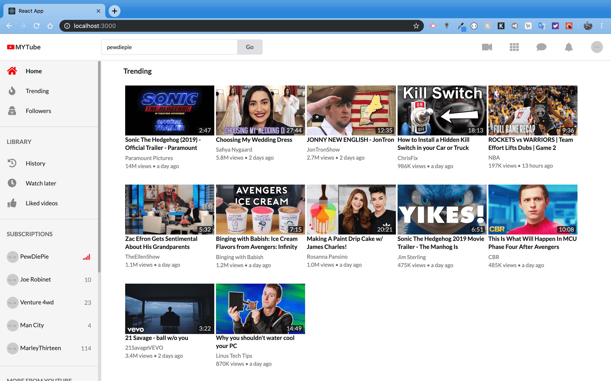
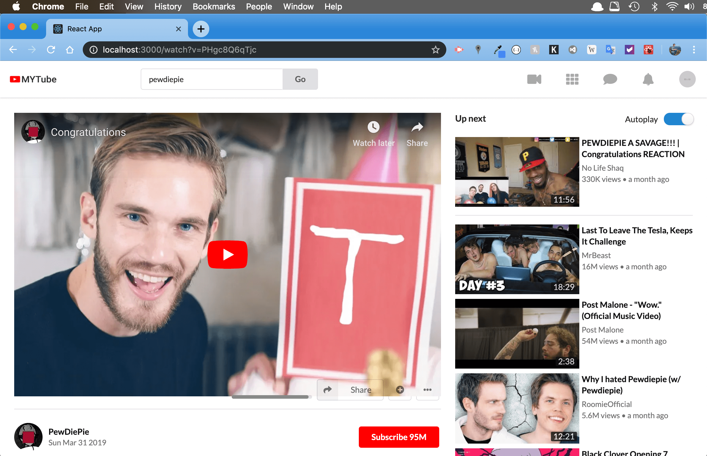

# youtube-react
A Youtube clone built in React, Redux, Redux-saga 

UI-wise this application looks almost exactly like the original Youtube application







It uses real data by leveraging the Youtube Data API v3. 

### How to run this application:
This application loads information using the Youtube Data API v3.

To use it, you need to set up a Youtube Data v3 API key and run the project with npm or yarn.

### Tests
This project contains an extensive suite of tests and makes use of Jest and Enzyme.

Run all tests by executing:
``` npm test ```

### Features
This application includes the major features of Youtube such as

* home feed with infinite scroll
* trending videos
* searching for videos
* watching videos
* displaying comments and video details

### Used technologies
* React / create-react-app
* Redux
* Redux-saga
* Redux-reselect
* Jest
* Enzyme
* Semantic UI
* CSS Grid / Flexbox

### Disclaimer
This project is solely intended for educational purposes and is created under fair use.

It is not intended to create any kind of Youtube competitor, but to practice advanced concepts in frontend development.
